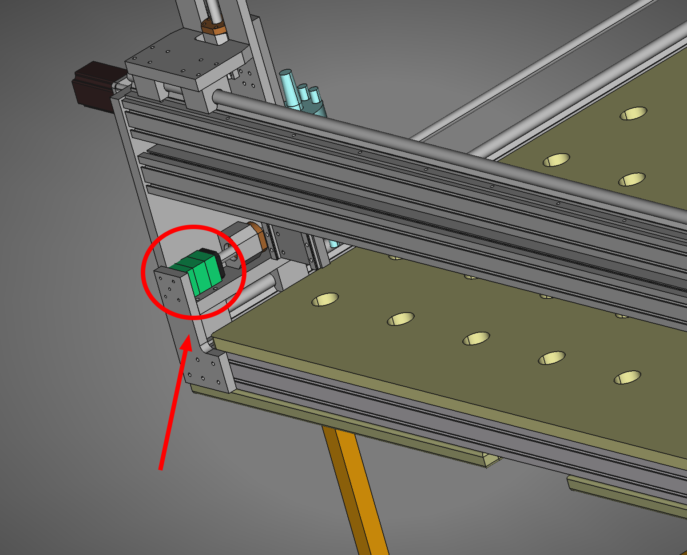
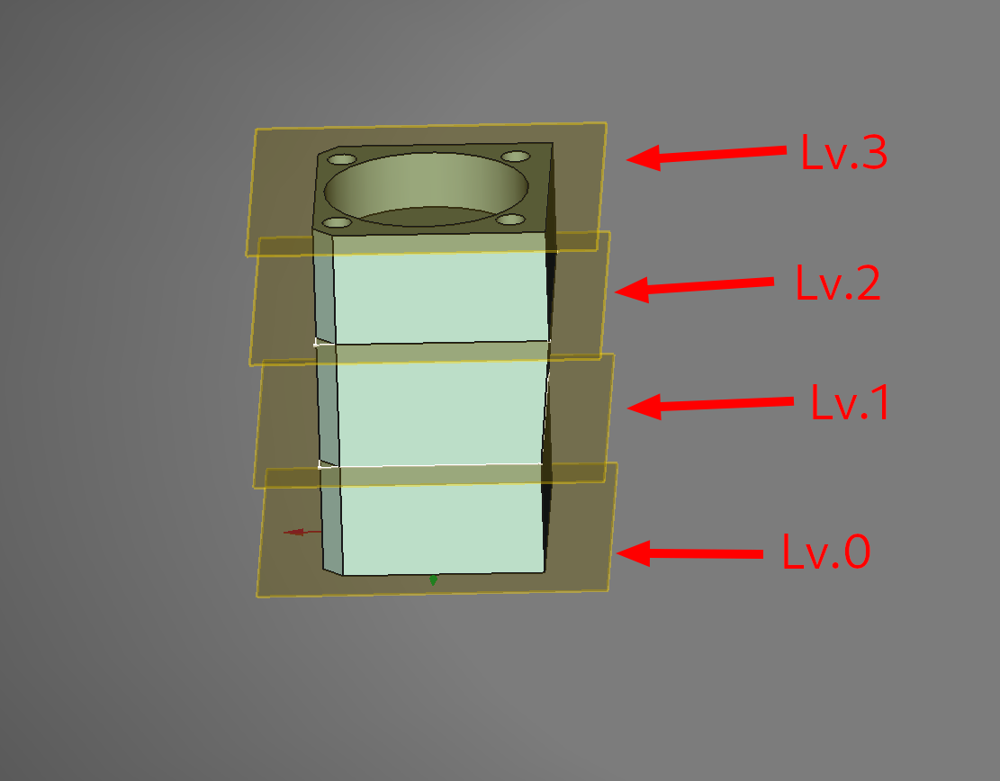
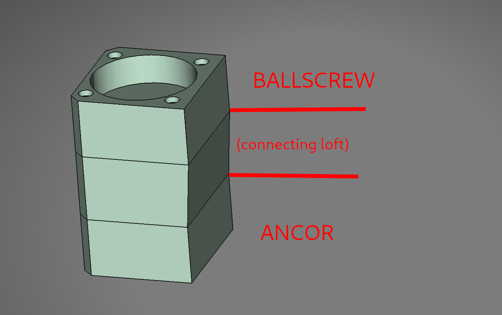
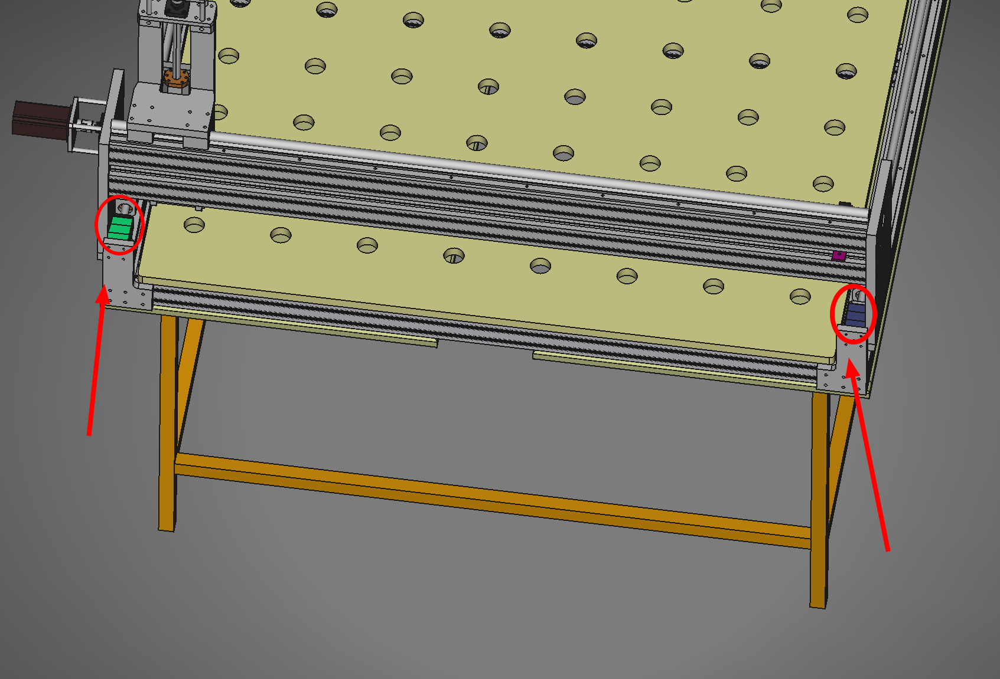
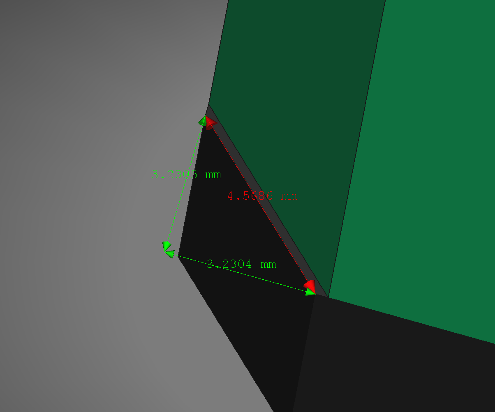
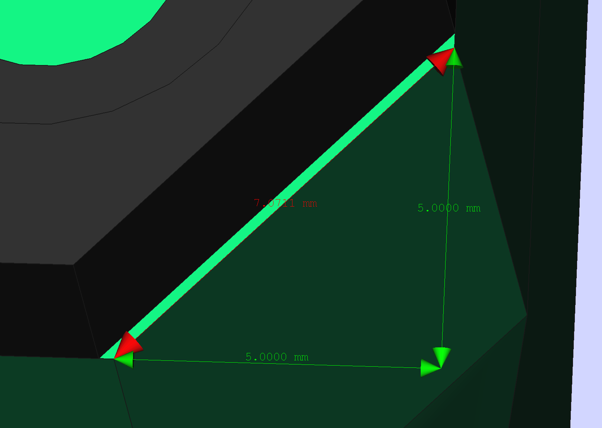

The ballscrew holder

Part is fully parametrized, refer to the Spreadsheet to adjust values

## Part anatomy

The part is sliced into 4 "levels" each being a dependent Datum Plane:

and separated into 2 semi-indepent parts that are Loft-ed together:

## Fabrication

The part is expected to be on each side of the CNC:

**THE SECOND PART NEEDS TO BE MIRRORED!!!**

# Known issues

## 1. irregularities with ballscrew mount

I am unable to fit the part to the ballscrew holder without making changes in the parametrization of the relevant part:

the other side experiences the same issue

